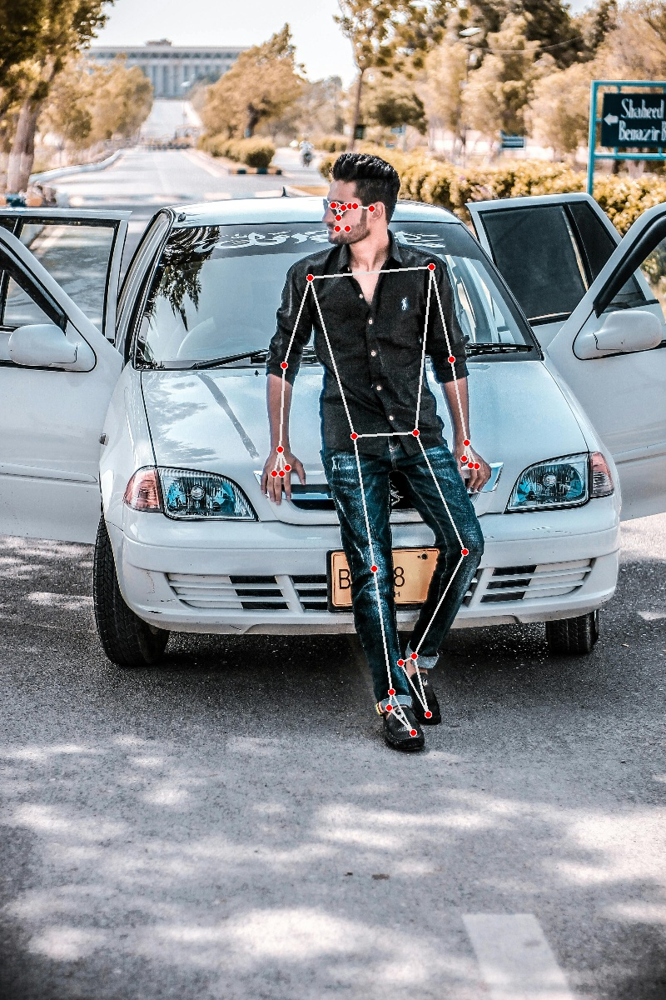

# mediapipe-pose

本專案使用 Google Mediapipe 進行靜態圖片中的人體姿勢偵測，並將偵測結果以骨架形式可視化。適合應用於運動姿勢分析、人體動作識別等場景。

This project uses Google Mediapipe to perform pose detection on static images, visualizing the detected results as a skeletal structure. It is suitable for applications such as sports posture analysis and human action recognition.

## 📷 功能介紹 | Features

- 偵測單人圖片中的人體 33 個關鍵姿勢點 | Detect 33 key human pose landmarks in a single-person image

- 繪製骨架與關節連線 | Draw skeletons and joint connections

- 儲存處理後的圖片 | Save the processed images

- 支援 JPG、PNG 格式圖片輸入 | Supports image input in JPG and PNG formats

## 🔧 使用技術 | Technologies

- Python 3.10

- Mediapipe

- OpenCV

## 🚀 安裝與執行 | Installation & Execution

### 1️⃣ 安裝必要套件 | Install Required Packages
```bash
pip install -r requirements.txt
```
### 2️⃣ 放入圖片 | Add Images

請將人物圖片放入 images/ 資料夾中（支援 .jpg、.png）。

Place your human images in the images/ folder (supports .jpg, .png formats).

### 3️⃣ 執行程式 | Run the Program
```bash
python main.py
```

### 4️⃣ 輸出結果 | Output

程式執行完畢後，處理結果會儲存在 output/ 資料夾中。

After execution, the processed images will be saved in the output/ folder.

## 📁 專案結構 | Project Structure
```cpp
mediapipe-pose/
├── main.py
├── requirements.txt
├── images/
├── output/
└── README.md
```
---

## 🖼️ 成果示意 | Result Example

| 原始圖片 Original Image | 偵測後 Detection |
|----------|---------|
|  |  |

## 📚 參考資料 | References
- Mediapipe Pose 官方文件https://google.github.io/mediapipe/solutions/pose.html

- OpenCV Python 官方網站https://pypi.org/project/mediapipe/